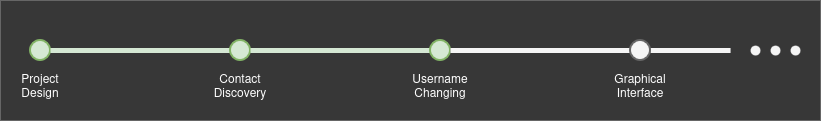

# AbyssChat : Decentralized Chat System

AbyssChat is a decentralized LAN Chat System running under Java.

## Design

### Goal

The goal of this project is to make a decentralized LAN chat system
where users are able to choose usernames, chat to each other, and
discover each other using a contact list.



## How to run

### Compilation

From the project directory, run:
```bash
mvn compile
```

### Running 

From the project directory, run:
```bash
mvn exec:java -Dexec.mainClass="net.chatsystem.Client
```

### Usage

- After running, input your username to login.
- Then use one of these commands

| Command           | Description              |
|-------------------|--------------------------|
| `/contacts`       | Show your contact list   |
| `/me`             | Show your profile        |
| `/changeusername` | Self-explanatory         |
| `/disconnect`     | Disconnect from the chat |

- You may also close the chat directly, it will automatically disconnect you


